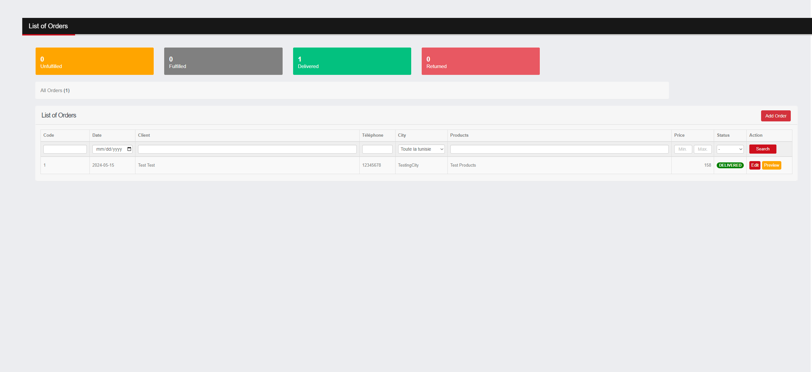

# Instagram Order Management

Welcome to Instagram Order Management! This project is designed to help you manage orders that come from Instagram.

## Features

- Add new orders
- Edit existing orders
- Delete orders
- View order details
- Manage client information
- Track order status

## Technologies Used

- Django
- Django REST Framework
- React
- Axios

## Getting Started

To get started with the project, follow these steps:

1. Clone this repository to your local machine.
2. Install the necessary dependencies using `pip install -r requirements.txt` for Django backend and `npm install` for React frontend.
3. Configure your database settings in `settings.py`.
4. Run migrations to create database tables using `python manage.py migrate`.
5. Start the Django development server using `python manage.py runserver`.
6. Navigate to the `frontend` directory and start the React development server using `npm start`.
7. Visit `http://localhost:3000` in your web browser to view the application.

